### Overview
Coming from a non-CS background, I never learned about design patterns. 
Over the years, as a research software developer during my Ph.D. and postdoc, it became increasingly important for me to understand their significance. 
When writing a large codebases that is expected to evolve over time and intended for widespread use, choosing the right design pattern can significantly impact your code's future (and mental sanity).

My first introduction to the subject was through the incredibly creative [refactoring.guru](https://refactoring.guru/design-patterns/singleton) website by Alexander Shvets. 
Subsequently, I took an online course in [Design Patterns](https://www.coursera.org/learn/design-patterns), which covered most of the original GoF patterns and more. 
I also frequently referred to the classic Gang of Four (GoF) book on the subject.

However, I found myself wanting a quick cheat sheet for these patterns, since I do not remember the details when I need it in my day-to-day.
Hence, I've created this blog to summarize these patterns through a simplified UML class diagrams. 
Ie's not meant to be comprehensive, as there are many websites dedicated to the subject. 
Instead, it's a simple and visual reference for those who, like me, prefer to have a quick overview at hand.

### What is a design pattern?
As Klaus Iglberger puts it, a design pattern has a name and carries an intent. Each design pattern aims at reducing dependencies within different components of your code and providing a certain level of abstraction.

Design patterns can be divided into three main categories: creational, structural, and behavioral.
The creational design patterns are concerned with providing various mechanisms to create objects. The structural design patterns deal with how classes and objects can be composed to form larger structures. 
The behavioral design patterns focus on how objects communicate and collaborate with each other to achieve specific tasks.

| Creational       || Structural   || Behavioral   |
| :--------------- || :----------- || :----------- |
| Singleton        || Adapter      || Command      |
| Factory Method   || Decorator    || Strategy     |
| Abstract Factory || Proxy        || Observer     |
| Builder          || Composite    || Mediator     |
| Prototype        || Bridge       || State        |
|                  || Flyweight    || Iterator     |
|                  ||              || Chain of Responsibility |
|                  ||              || Memento      |
|                  ||              || Template Method |
|                  ||              || Visitor      |

Below I provide a brief summary of each design pattern and a simplified UML diagram.
In the future, I will update this blog to provide more information.
I also intend to add a real-life example from a typical research software.

### Singleton
Ensures that a class has only one instance and provides a global point of access to that instance.
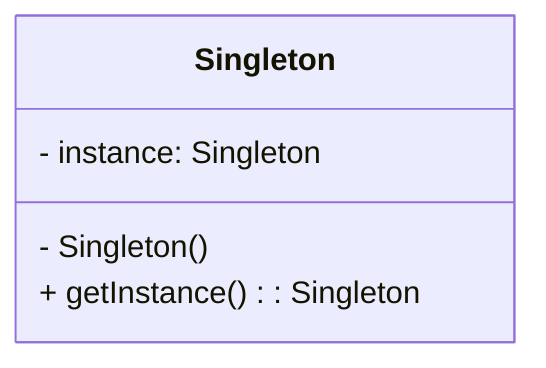
```mermaid
classDiagram
    class Singleton {
        - instance: Singleton
        - Singleton()
        + getInstance(): Singleton
    }
```

#### Factory Method
Defines an interface for creating an object, but allows subclasses to alter the type of objects that will be created.
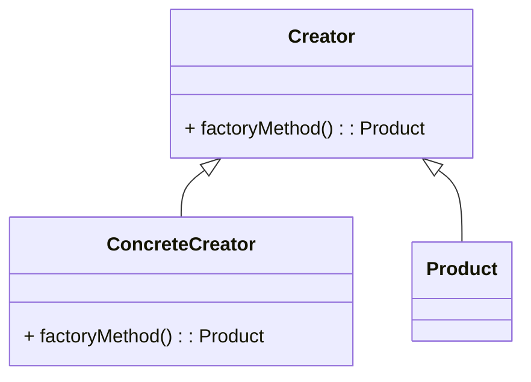
```mermaid
classDiagram
    class Creator {
        + factoryMethod(): Product
    }
    class ConcreteCreator {
        + factoryMethod(): Product
    }
    class Product

    Creator <|-- ConcreteCreator
    Creator <|-- Product
```

### Abstract Factory
Provides an interface for creating families of related or dependent objects without specifying their concrete classes.
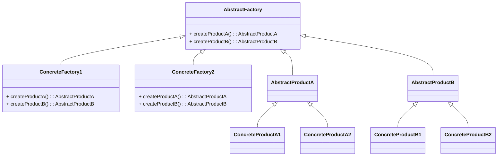
```mermaid
classDiagram
    class AbstractFactory {
        + createProductA(): AbstractProductA
        + createProductB(): AbstractProductB
    }
    class ConcreteFactory1 {
        + createProductA(): AbstractProductA
        + createProductB(): AbstractProductB
    }
    class ConcreteFactory2 {
        + createProductA(): AbstractProductA
        + createProductB(): AbstractProductB
    }
    class AbstractProductA
    class ConcreteProductA1
    class ConcreteProductA2
    class AbstractProductB
    class ConcreteProductB1
    class ConcreteProductB2

    AbstractFactory <|-- ConcreteFactory1
    AbstractFactory <|-- ConcreteFactory2
    AbstractFactory <|-- AbstractProductA
    AbstractFactory <|-- AbstractProductB
    AbstractProductA <|-- ConcreteProductA1
    AbstractProductA <|-- ConcreteProductA2
    AbstractProductB <|-- ConcreteProductB1
    AbstractProductB <|-- ConcreteProductB2
```

### Builder
Separates the construction of a complex object from its representation, allowing the same construction process to create various representations.
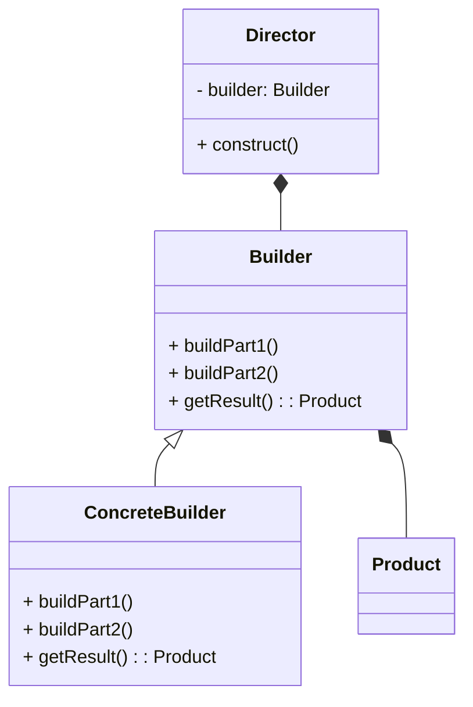
```mermaid
classDiagram
    class Director {
        - builder: Builder
        + construct()
    }
    class Builder {
        + buildPart1()
        + buildPart2()
        + getResult(): Product
    }
    class ConcreteBuilder {
        + buildPart1()
        + buildPart2()
        + getResult(): Product
    }
    class Product

    Director *-- Builder
    Builder <|-- ConcreteBuilder
    Builder *-- Product
```

### Prototype
Creates new objects by copying an existing object, known as the prototype.
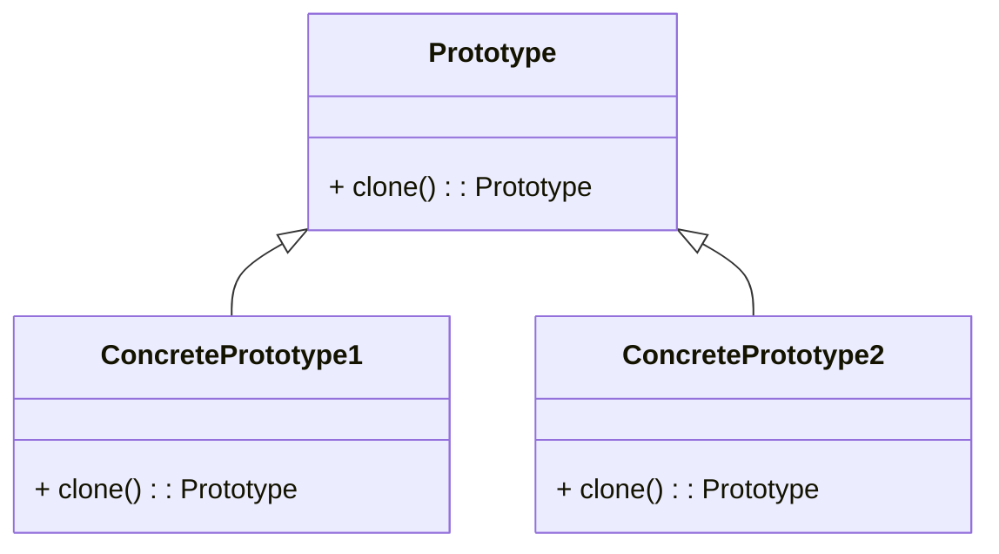
```mermaid
classDiagram
    class Prototype {
        + clone(): Prototype
    }
    class ConcretePrototype1 {
        + clone(): Prototype
    }
    class ConcretePrototype2 {
        + clone(): Prototype
    }

    Prototype <|-- ConcretePrototype1
    Prototype <|-- ConcretePrototype2
```

### Composite
Composes objects into tree structures to represent part-whole hierarchies, allowing clients to treat individual objects and compositions of objects uniformly.
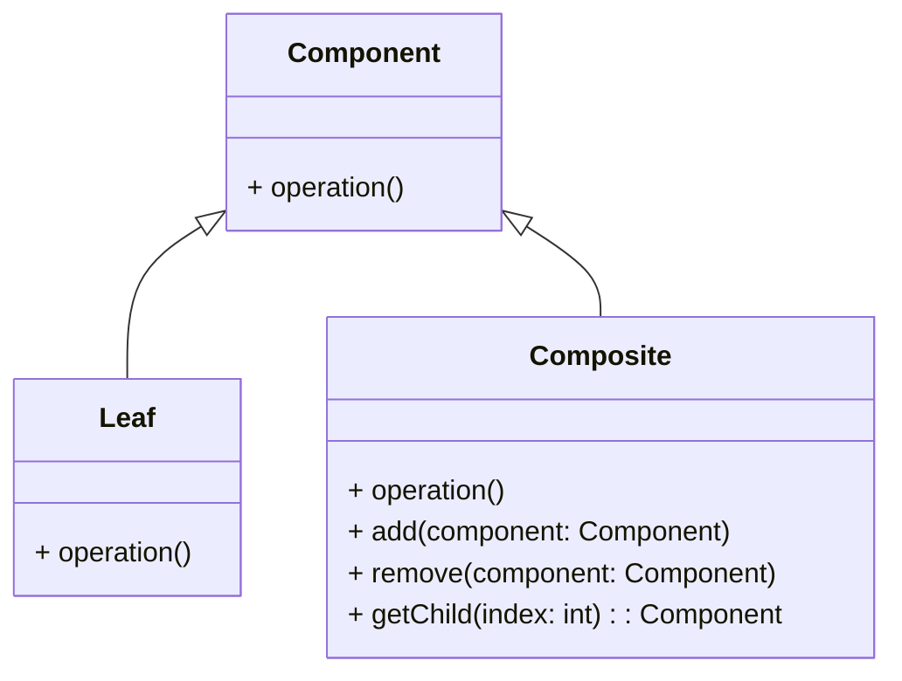
```mermaid
classDiagram
    class Component {
        + operation()
    }
    class Leaf {
        + operation()
    }
    class Composite {
        + operation()
        + add(component: Component)
        + remove(component: Component)
        + getChild(index: int): Component
    }

    Component <|-- Leaf
    Component <|-- Composite
```

### Facade
Provides a unified interface to a set of interfaces in a subsystem, simplifying and abstracting the complexity of the system.
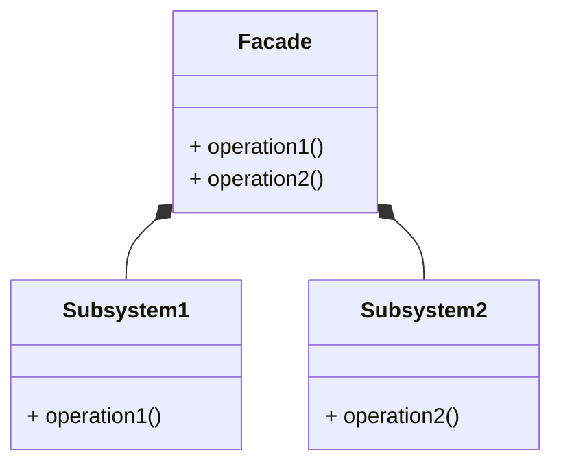
```mermaid
classDiagram
    class Facade {
        + operation1()
        + operation2()
    }
    class Subsystem1 {
        + operation1()
    }
    class Subsystem2 {
        + operation2()
    }

    Facade *-- Subsystem1
    Facade *-- Subsystem2
```

### Adapter 
 Allows incompatible interfaces to work together by wrapping an interface around an existing class.
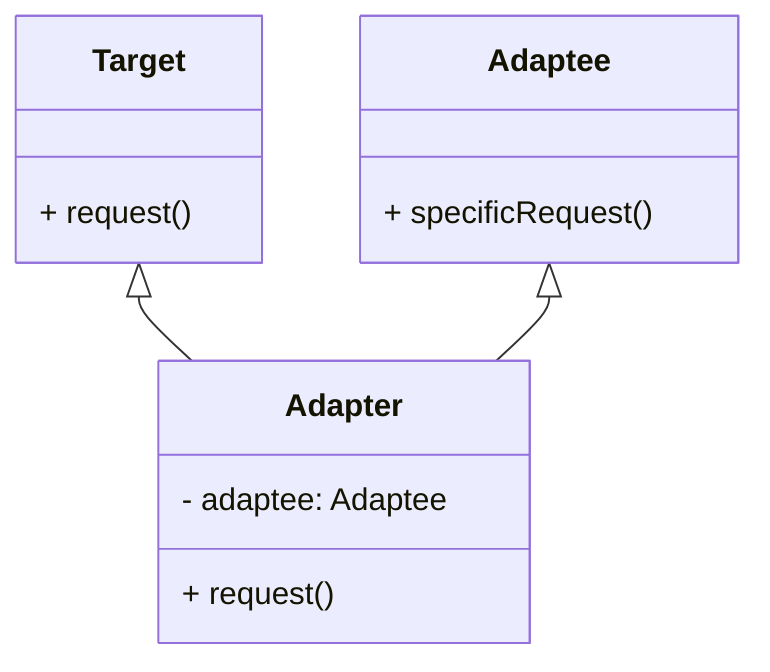
```mermaid
classDiagram
    class Target {
        + request()
    }
    class Adaptee {
        + specificRequest()
    }
    class Adapter {
        - adaptee: Adaptee
        + request()
    }

    Target <|-- Adapter
    Adaptee <|-- Adapter
```

### Decorator
Attaches additional responsibilities to an object dynamically, providing a flexible alternative to subclassing for extending functionality.
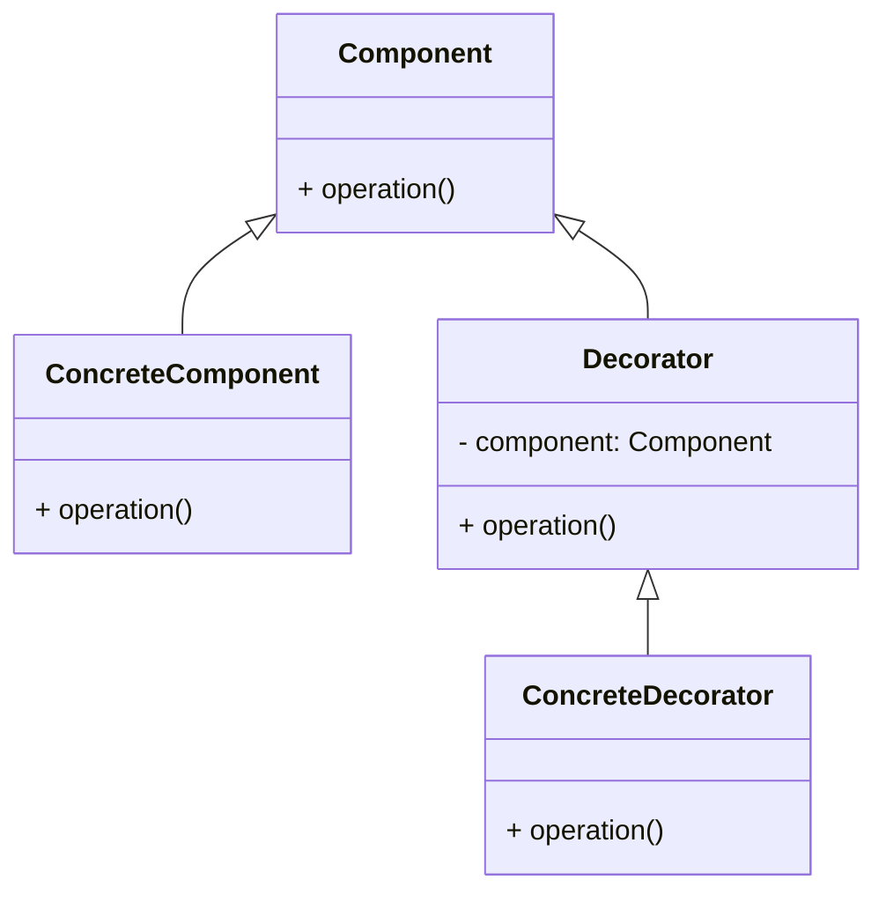
```mermaid
classDiagram
    class Component {
        + operation()
    }
    class ConcreteComponent {
        + operation()
    }
    class Decorator {
        - component: Component
        + operation()
    }
    class ConcreteDecorator {
        + operation()
    }

    Component <|-- ConcreteComponent
    Component <|-- Decorator
    Decorator <|-- ConcreteDecorator
```

### Bridge
Decouples an abstraction from its implementation so that the two can vary independently.
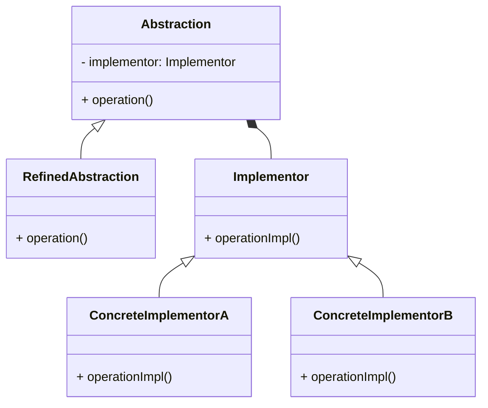
```mermaid
classDiagram
    class Abstraction {
        - implementor: Implementor
        + operation()
    }
    class RefinedAbstraction {
        + operation()
    }
    class Implementor {
        + operationImpl()
    }
    class ConcreteImplementorA {
        + operationImpl()
    }
    class ConcreteImplementorB {
        + operationImpl()
    }

    Abstraction *-- Implementor
    Abstraction <|-- RefinedAbstraction
    Implementor <|-- ConcreteImplementorA
    Implementor <|-- ConcreteImplementorB
```

### Flyweight
Minimizes memory usage and improves performance by sharing as much as possible with similar objects.
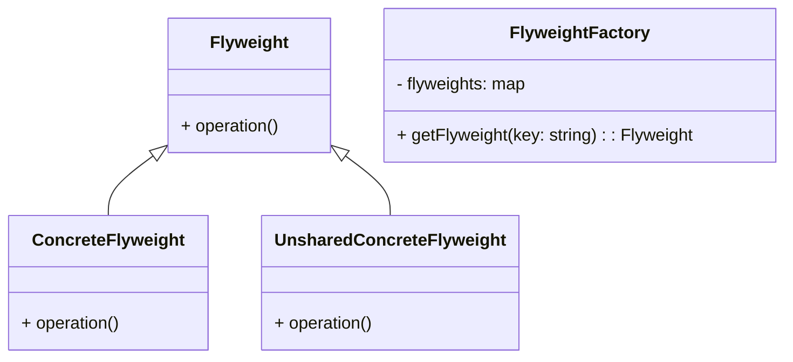
```mermaid
classDiagram
    class Flyweight {
        + operation()
    }
    class ConcreteFlyweight {
        + operation()
    }
    class UnsharedConcreteFlyweight {
        + operation()
    }
    class FlyweightFactory {
        - flyweights: map<string, Flyweight>
        + getFlyweight(key: string): Flyweight
    }

    Flyweight <|-- ConcreteFlyweight
    Flyweight <|-- UnsharedConcreteFlyweight
```

### Proxy
 Provides a placeholder for another object to control access, reduce cost, or add functionality.
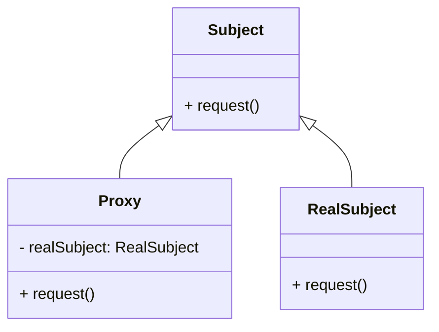
```mermaid
classDiagram
    class Subject {
        + request()
    }
    class RealSubject {
        + request()
    }
    class Proxy {
        - realSubject: RealSubject
        + request()
    }

    Subject <|-- Proxy
    Subject <|-- RealSubject
```

### Command
Encapsulates a request as an object containing all information about the request, thereby allowing for parameterization of methods with different requests. 
You can then use these objects to delay or queue execution of these requests.

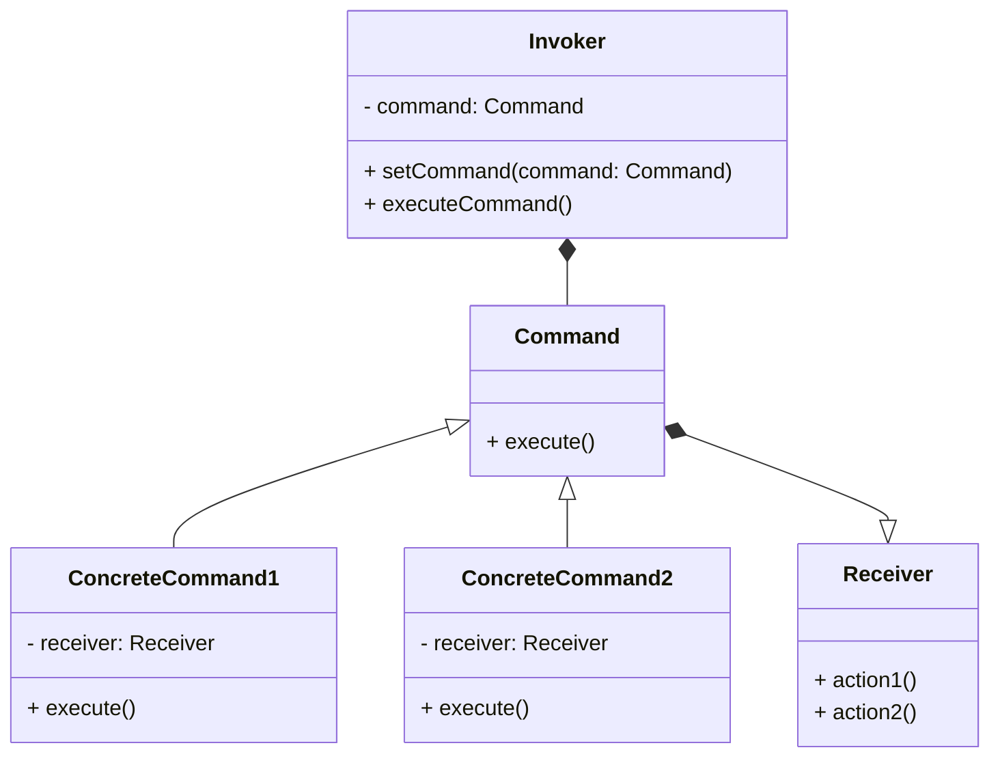
```mermaid
classDiagram
    class Command {
        + execute()
    }
    class Receiver {
        + action1()
        + action2()
    }
    class ConcreteCommand1 {
        - receiver: Receiver
        + execute()
    }
    class ConcreteCommand2 {
        - receiver: Receiver
        + execute()
    }
    class Invoker {
        - command: Command
        + setCommand(command: Command)
        + executeCommand()
    }

    Command <|-- ConcreteCommand1
    Command <|-- ConcreteCommand2
    Command *--|> Receiver
    Invoker *-- Command
``` 

### Strategy
Defines a family of algorithms, encapsulates each one, and makes them interchangeable, letting the algorithm vary independently from clients that use it.
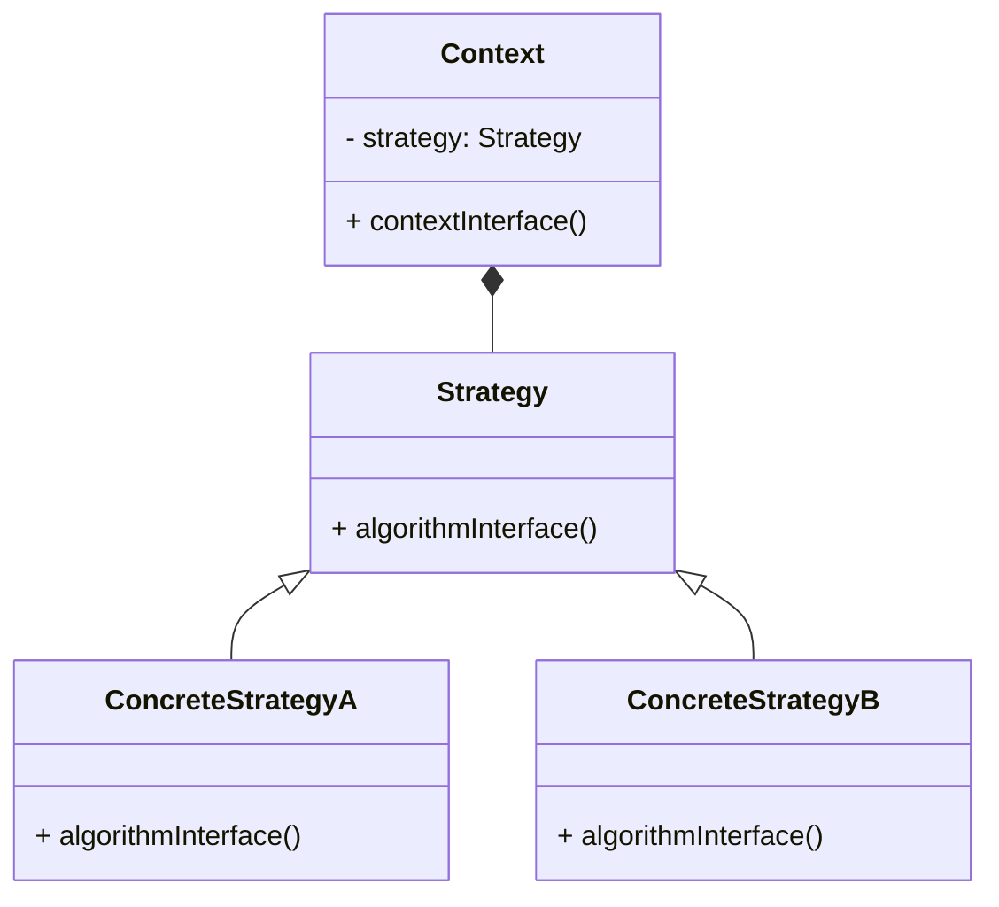
```mermaid
classDiagram
    class Strategy {
        + algorithmInterface()
    }
    class ConcreteStrategyA {
        + algorithmInterface()
    }
    class ConcreteStrategyB {
        + algorithmInterface()
    }
    class Context {
        - strategy: Strategy
        + contextInterface()
    }

    Strategy <|-- ConcreteStrategyA
    Strategy <|-- ConcreteStrategyB
    Context *-- Strategy
``` 

### Template Method
 Defines the skeleton of an algorithm in the superclass but lets subclasses override specific steps of the algorithm without changing its structure.
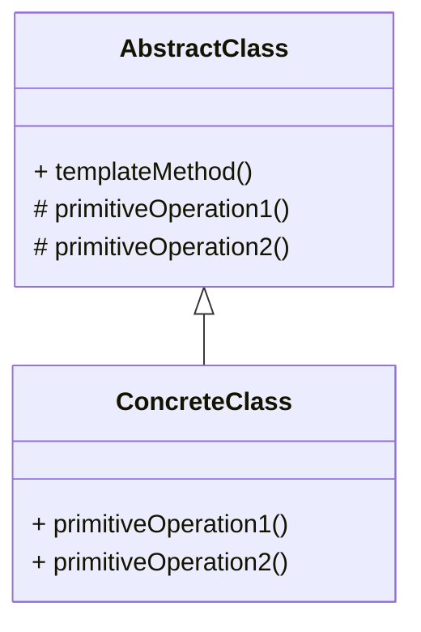
```mermaid
classDiagram
    class AbstractClass {
        + templateMethod()
        # primitiveOperation1()
        # primitiveOperation2()
    }
    class ConcreteClass {
        + primitiveOperation1()
        + primitiveOperation2()
    }

    AbstractClass <|-- ConcreteClass
``` 

### Visitor
Defines a new operation to a collection of objects without changing the objects themselves.
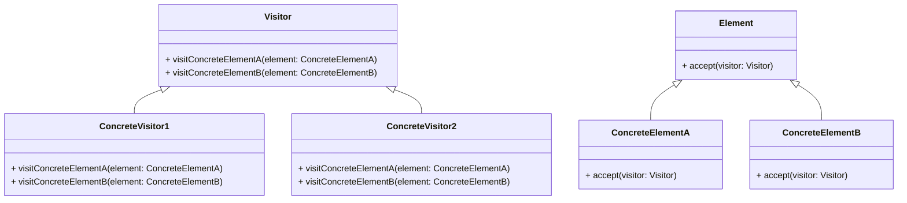
```mermaid
classDiagram
    class Visitor {
        + visitConcreteElementA(element: ConcreteElementA)
        + visitConcreteElementB(element: ConcreteElementB)
    }
    class ConcreteVisitor1 {
        + visitConcreteElementA(element: ConcreteElementA)
        + visitConcreteElementB(element: ConcreteElementB)
    }
    class ConcreteVisitor2 {
        + visitConcreteElementA(element: ConcreteElementA)
        + visitConcreteElementB(element: ConcreteElementB)
    }
    class Element {
        + accept(visitor: Visitor)
    }
    class ConcreteElementA {
        + accept(visitor: Visitor)
    }
    class ConcreteElementB {
        + accept(visitor: Visitor)
    }

    Visitor <|-- ConcreteVisitor1
    Visitor <|-- ConcreteVisitor2
    Element <|-- ConcreteElementA
    Element <|-- ConcreteElementB
``` 

### Observer
Defines a one-to-many dependency between objects so that when one object changes state, all its dependents are notified and updated automatically.
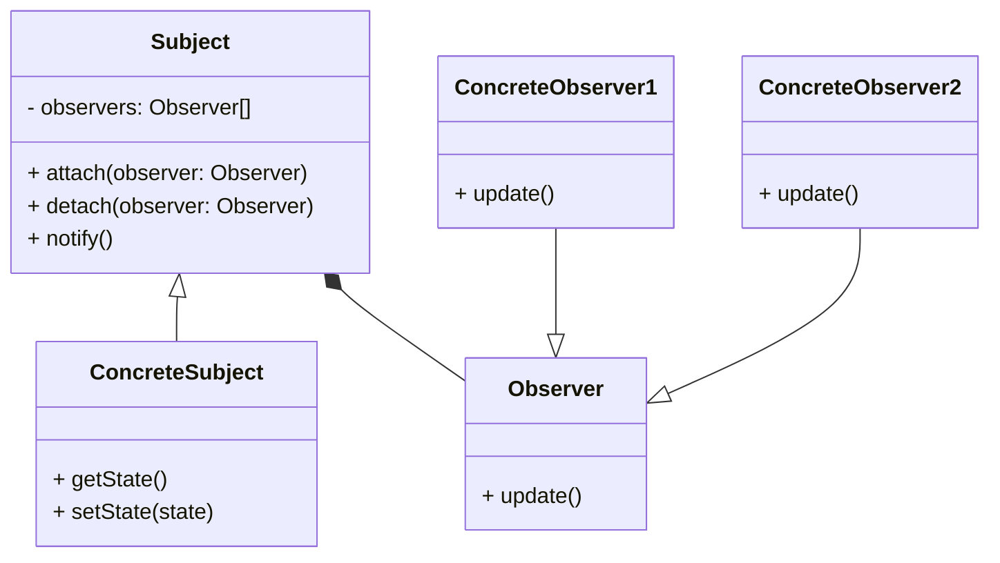
```mermaid
classDiagram
    class Subject {
        - observers: Observer[]
        + attach(observer: Observer)
        + detach(observer: Observer)
        + notify()
    }
    class ConcreteSubject {
        + getState()
        + setState(state)
    }
    class Observer {
        + update()
    }
    class ConcreteObserver1 {
        + update()
    }
    class ConcreteObserver2 {
        + update()
    }

    Subject <|-- ConcreteSubject
    Subject *-- Observer
    ConcreteObserver1 --|> Observer
    ConcreteObserver2 --|> Observer
``` 

### Mediator
Defines an object that encapsulates how a set of objects interact, promoting loose coupling by keeping objects from referring to each other explicitly.
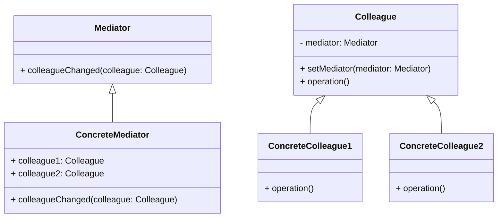
```mermaid
classDiagram
    class Mediator {
        + colleagueChanged(colleague: Colleague)
    }
    class ConcreteMediator {
        + colleague1: Colleague
        + colleague2: Colleague
        + colleagueChanged(colleague: Colleague)
    }
    class Colleague {
        - mediator: Mediator
        + setMediator(mediator: Mediator)
        + operation()
    }
    class ConcreteColleague1 {
        + operation()
    }
    class ConcreteColleague2 {
        + operation()
    }

    Mediator <|-- ConcreteMediator
    Colleague <|-- ConcreteColleague1
    Colleague <|-- ConcreteColleague2
``` 

### State
Allows an object to alter its behavior when its internal state changes, encapsulating state-dependent behavior into separate state objects and allowing for easier transitions between states.
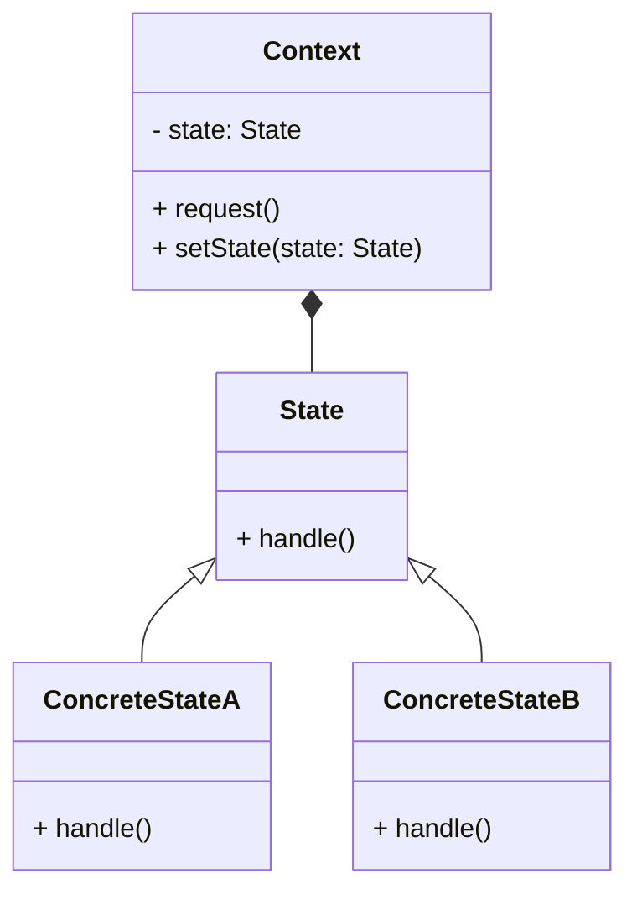
```mermaid
classDiagram
    class Context {
        - state: State
        + request()
        + setState(state: State)
    }
    class State {
        + handle()
    }
    class ConcreteStateA {
        + handle()
    }
    class ConcreteStateB {
        + handle()
    }

    Context *-- State
    State <|-- ConcreteStateA
    State <|-- ConcreteStateB
``` 

### Iterator
Provides a way to access the elements of an aggregate object sequentially without exposing its underlying representation.
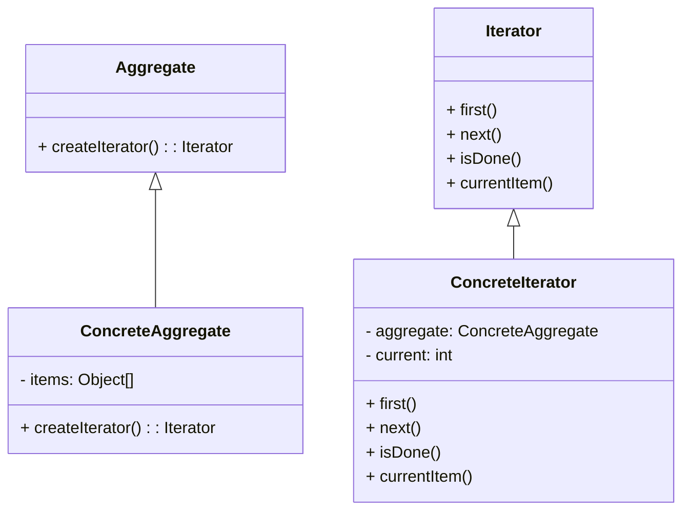
```mermaid
classDiagram
    class Aggregate {
        + createIterator(): Iterator
    }
    class ConcreteAggregate {
        - items: Object[]
        + createIterator(): Iterator
    }
    class Iterator {
        + first()
        + next()
        + isDone()
        + currentItem()
    }
    class ConcreteIterator {
        - aggregate: ConcreteAggregate
        - current: int
        + first()
        + next()
        + isDone()
        + currentItem()
    }

    Aggregate <|-- ConcreteAggregate
    Iterator <|-- ConcreteIterator
``` 

### Chain of Responsibility
Allows multiple objects to handle a request without the sender needing to know which object will handle it, decoupling senders from receivers.
```mermaid
classDiagram
    class Handler {
        - successor: Handler
        + handleRequest()
    }
    class ConcreteHandler1 {
        + handleRequest()
    }
    class ConcreteHandler2 {
        + handleRequest()
    }
    class ConcreteHandler3 {
        + handleRequest()
    }

    Handler <|-- ConcreteHandler1
    Handler <|-- ConcreteHandler2
    Handler <|-- ConcreteHandler3
``` 

### Memento
Captures and externalizes an object's internal state so that the object can be restored to this state later, without violating encapsulation.
```mermaid
classDiagram
    class Originator {
        - state: string
        + createMemento(): Memento
        + restoreMemento(memento: Memento)
    }
    class Memento {
        - state: string
        + getState(): string
        + setState(state: string)
    }
    class Caretaker {
        - memento: Memento
        + getMemento(): Memento
        + setMemento(memento: Memento)
    }

    Originator *-- Memento
    Caretaker *-- Memento
``` 

### Further Exploration

- [Design Patterns: Elements of Reusable Object-Oriented Software](https://www.amazon.com/Design-Patterns-Elements-Reusable-Object-Oriented/dp/0201633612) by Erich Gamma, Richard Helm, Ralph Johnson, and John Vlissides (The Gang of Four)
- [Design Patterns](https://www.coursera.org/learn/design-patterns), a Coursera course by Kenny Wong from University of Alberta
- [refactoring.guru](https://refactoring.guru/design-patterns/singleton) by Alexander Shvets
- [Conceptual codes in C++](https://github.com/saurabh-s-sawant/design-patterns-cpp) by Alexander Shvets
- [Modern C++ Design: Generic Programming and Design Patterns Applied](https://www.amazon.com/Modern-Design-Generic-Programming-Patterns/dp/0201704315/ref=sr_1_1?crid=II9HPHVRNCDI&dib=eyJ2IjoiMSJ9.rZZG5wYKG8cmgNTbJT-J_sjM5CjdZwnvPR7QXmIo9qv_tFcUGikpBKyK261t9ORhdc0Y0pEKezME-i3xNdYQ7K3Pew1T4laTHxuvQskEqvk.aCGps9PShRpb79yLj7H1U2YLYRt56x-xYp1T2jsBcu0&dib_tag=se&keywords=Modern+C%2B%2B+Design%3A+Generic+Programming+and+Design+Patterns+Applied&qid=1713731193&s=books&sprefix=%2Cstripbooks%2C495&sr=1-1) by Andrei Alexandrescu
